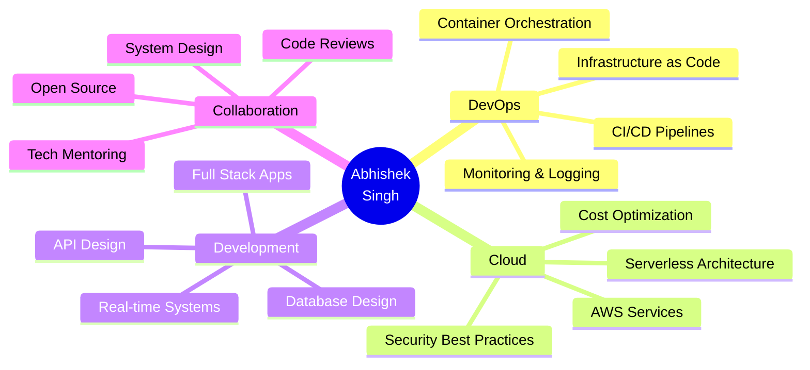

<div align="center">


[](https://git.io/typing-svg)

<p align="center">
  <a href="https://abhi-portfolio-gold.vercel.app/"></a>
  <a href="https://linkedin.com/in/abhishek-singh-1604b9221"></a>
  <a href="mailto:singh.421.aspabhiya@gmail.com"></a>
  <a href="https://github.com/abhiya492"></a>
</p>

<p align="center">
  
  
  
  
</p>

</div>

---


### 🚀 **Quick Intro**

```typescript
const abhishekSingh: Developer = {
  role: "AWS Certified DevOps Engineer",
  company: "HabileLabs",
  location: "Jaipur, India 🇮🇳",
  education: "MNIT Jaipur '25",
  
  achievements: {
    costReduction: "20%",
    uptime: "99.9%",
    concurrentUsers: "100+",
    githubStars: "31+",
    certifications: ["AWS Cloud Practitioner"]
  },
  
  currentlyLearning: ["Kubernetes", "Microservices", "System Design"],
  askMeAbout: ["AWS", "DevOps", "Full Stack", "Cloud Architecture"],
  funFact: "I automate everything, even my coffee breaks ☕"
};
```

<br clear="right"/>

---

## 💼 **Professional Journey**

<details open>
<summary><b>🏢 HabileLabs - Associate Software Engineer</b></summary>
<br>

**Duration:** June 2025 - Present  
**Project:** AWS Cost Optimization Platform

**🎯 Impact:**
- 💰 Reduced infrastructure costs by **20%**
- 📊 Achieved **99.9% uptime** with CloudWatch monitoring
- 🚀 Built full-stack serverless platform
- 🔒 Implemented enterprise security best practices

**🛠️ Tech Stack:**
```yaml
Frontend: React, TypeScript, AWS Amplify
Backend: AWS Lambda, AppSync (GraphQL), DynamoDB, Step Functions
DevOps: CI/CD, CloudWatch, IAM, KMS Encryption
Automation: Python scripts, Cost anomaly detection
```

**📈 Key Responsibilities:**
- Architected serverless backend for multi-account cost synchronization
- Developed real-time cost monitoring dashboards
- Configured custom alarms and log aggregation
- Established IAM policies, VPC security, and secrets management

</details>

---

## 🛠️ **Tech Arsenal**

<div align="center">

### 💻 **Languages**


### 🎨 **Frontend**


### ⚙️ **Backend**


### 🗄️ **Databases**


### ☁️ **DevOps & Cloud**


### 🔧 **Tools**


</div>

---

## 🎨 **Spotlight Projects**

<table>
<tr>
<td width="50%">

### 🚀 [Real-time Chat App](https://github.com/abhiya492) ⭐15
*MERN + Kubernetes + CI/CD*

**✨ Features:**
- 💬 100+ features with Socket.io & WebRTC
- 🎥 Video calls, voice rooms, multiplayer games
- 🤖 Groq AI integration
- 🎨 95% mobile responsive UI

**🏗️ Infrastructure:**
- 🐳 K8s with 3 backend + 2 frontend replicas
- 📈 HPA auto-scaling
- 💾 MongoDB & Redis with persistent storage
- 📊 Prometheus + Grafana (15+ dashboards)

**⚡ Performance:**
- Sub-100ms response times
- 99.9% uptime
- 100+ concurrent users

**🔐 Security:**
- Trivy security scanning
- JWT authentication
- Rate limiting

</td>
<td width="50%">

### 🎟️ [Ticketing Marketplace SaaS](https://github.com/abhiya492) ⭐16
*Next.js 15 + TypeScript + Stripe*

**✨ Features:**
- 🎫 Full event management system
- 💳 Stripe Connect integration
- 📊 Real-time analytics dashboard
- ⏱️ Fair queue system
- 💰 Subscription management

**🛠️ Tech Stack:**
- Next.js 15 with Server Actions
- TypeScript & Shadcn UI
- Tailwind CSS
- PostgreSQL with Prisma
- Stripe webhooks

**📈 Business Features:**
- Revenue analytics
- Email notifications
- Mobile responsive
- Multi-event support

</td>
</tr>
</table>

<div align="center">

[](https://github.com/abhiya492)
[](https://github.com/abhiya492)

</div>

---

## 📊 **GitHub Analytics Dashboard**

<div align="center">
  
  
</div>

<div align="center">
  
  
</div>

<div align="center">
  
</div>

---

## 🏆 **Achievements & Trophies**

<div align="center">
  
</div>

<table align="center">
<tr>
<td align="center" width="33%">

### 🎓 **Certifications**


*Currently pursuing:*  
AWS Solutions Architect

</td>
<td align="center" width="33%">

### 📈 **Impact Metrics**
🎯 **20%** Cost Reduction  
⚡ **99.9%** Uptime  
👥 **100+** Concurrent Users  
⭐ **31+** GitHub Stars

</td>
<td align="center" width="33%">

### 🏅 **Quick Stats**
📝 **50+** Repositories  
🔥 **100+** Contributions  
🌟 **Active** Developer  
🚀 **Production** Ready

</td>
</tr>
</table>

---

## 📈 **Contribution Snake**

<picture>
  <source media="(prefers-color-scheme: dark)" srcset="https://raw.githubusercontent.com/abhiya492/abhiya492/output/github-contribution-grid-snake-dark.svg">
  <source media="(prefers-color-scheme: light)" srcset="https://raw.githubusercontent.com/abhiya492/abhiya492/output/github-contribution-grid-snake.svg">
  
</picture>

---

## 🎓 **Education**

<div align="center">

### **MNIT Jaipur**
**Bachelor of Technology in Electrical Engineering** | 2021-2025

**Relevant Coursework:**  
Data Structures & Algorithms • Object-Oriented Programming • Cloud Computing  
DevOps • Database Management Systems • Operating Systems

</div>

---

## 🌟 **Daily Motivation**

<div align="center">


[](https://github.com/piyushsuthar/github-readme-quotes)

</div>

---

## 📫 **Let's Connect**

<div align="center">

### 💬 **Get in Touch**

<a href="https://linkedin.com/in/abhishek-singh-1604b9221">
  
</a>
<a href="mailto:singh.421.aspabhiya@gmail.com">
  
</a>
<a href="https://abhi-portfolio-gold.vercel.app/">
  
</a>
<a href="tel:+919305248855">
  
</a>

### 🌐 **Social Media**

[](https://twitter.com/abhiya492)
[](https://instagram.com/abhiya492)
[](https://youtube.com/@abhiya492)
[](https://dev.to/abhiya492)

</div>

---

## 💡 **Currently**

```typescript
const currentStatus = {
  🔭 workingOn: "AWS Cost Optimization Platform @ HabileLabs",
  🌱 learning: ["Kubernetes", "Microservices Architecture", "System Design"],
  👯 lookingToCollaborate: ["Open Source", "DevOps Tools", "Cloud Projects"],
  🤔 lookingForHelp: ["System Design Best Practices", "Advanced K8s"],
  💬 askMeAbout: ["AWS", "DevOps", "Full Stack", "Cloud Architecture"],
  📫 reachMe: "singh.421.aspabhiya@gmail.com",
  😄 pronouns: "He/Him",
  ⚡ funFact: "I debug in production... said no one ever! 😅"
};
```

---

## 🎯 **What I Can Help You With**

<div align="center">



</div>

---

## 🚀 **Open for Opportunities**

<div align="center">

### 🎯 **Seeking Roles In**


### 💼 **Preferred Work Mode**


---

### ✨ **"Building scalable solutions, one commit at a time"**

*Passionate about automation, cloud architecture, and creating impactful solutions*

</div>

---

<div align="center">

### 📊 **Profile Summary**


</div>

---

<div align="center">

### 🎮 **Fun Corner**

<details>
<summary><b>🎲 Random Dev Joke</b></summary>
<br>


</details>

<details>
<summary><b>🎵 Coding Playlist</b></summary>
<br>

[](https://open.spotify.com/user/abhiya492)

*Connect your Spotify to show what you're listening to!*

</details>

<details>
<summary><b>☕ Support My Work</b></summary>
<br>

If you like my work, consider buying me a coffee! ☕

[](https://buymeacoffee.com/abhiya492)
[](https://paypal.me/abhiya492)

</details>

</div>

---

<div align="center">


**Made with ❤️ by [Abhishek Singh](https://github.com/abhiya492)**


**⭐ From [abhiya492](https://github.com/abhiya492) | AWS Certified DevOps Engineer | MNIT Jaipur**

</div>
