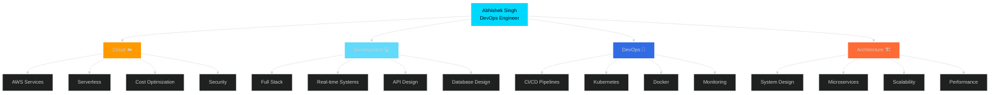

<div align="center">

<!-- Animated Header with Gradient Wave -->


<!-- Dynamic Typing Animation with Multiple Lines -->
[](https://git.io/typing-svg)

<!-- Animated Badge Collection -->
<p align="center">
  <a href="https://abhi-portfolio-gold.vercel.app/">
    
  </a>
  <a href="https://linkedin.com/in/abhishek-singh-1604b9221">
    
  </a>
  <a href="mailto:singh.421.aspabhiya@gmail.com">
    
  </a>
  <a href="https://github.com/abhiya492">
    
  </a>
</p>

<!-- Live Stats with Animations -->
<p align="center">
  
  
</p>

<!-- Live Clock & Status -->
<p align="center">
  
  
  
</p>

</div>

---

<!-- Animated GIF Side by Side Layout -->


### 🚀 **About Me - Real-Time Profile**

```typescript
const abhishekSingh = {
  name: "Abhishek Singh",
  role: "AWS Certified Engineer",
  company: "HabileLabs",
  location: "Jaipur, India 🇮🇳",
  education: "MNIT Jaipur '25",
  
  achievements: {
    💰 costReduction: "20%",
    ⚡ uptime: "99.9%",
    👥 concurrentUsers: "100+",
    ⭐ githubStars: "31+",
    🎓 certifications: ["AWS Cloud Practitioner"]
  },
  
  currentlyLearning: [
    "Kubernetes Advanced",
    "Microservices Architecture", 
    "System Design Patterns",
    "AWS Solutions Architect"
  ],
  
  expertise: [
    "AWS Cloud Infrastructure",
    "CI/CD Pipeline Automation",
    "Containerization & Orchestration",
    "Full Stack Development",
    "Real-time Systems"
  ],
  
  askMeAbout: [
    "☁️ AWS Architecture",
    "🔄 DevOps Best Practices",
    "🚀 Full Stack Development",
    "📊 System Design",
    "🐳 Kubernetes & Docker"
  ],
  
  funFact: "I automate everything, even my coffee breaks ☕",
  availableFor: "Freelance, Full-time, Consulting"
};

console.log("👋 Let's build something amazing together!");
```

<br clear="right"/>

---

## 💼 **Professional Journey & Impact**

<details open>
<summary><b>🏢 HabileLabs - Associate Software Engineer (June 2025 - Present)</b></summary>

<br>

<table>
<tr>
<td width="50%">

### 🎯 **Project: AWS Cost Optimization Platform**

**Business Impact:**
- 💰 **20% Infrastructure Cost Reduction**
- 📊 **99.9% System Uptime**
- ⚡ **Real-time Cost Monitoring**
- 🔒 **Enterprise-Grade Security**

**Key Achievements:**
- ✅ Architected serverless multi-account sync
- ✅ Built real-time dashboards with React
- ✅ Implemented CloudWatch monitoring
- ✅ Configured IAM policies & VPC security
- ✅ Automated cost anomaly detection

</td>
<td width="50%">

### 🛠️ **Technology Stack**

```yaml
Frontend:
  - React + TypeScript
  - AWS Amplify
  - Real-time WebSockets
  
Backend:
  - AWS Lambda
  - AppSync (GraphQL)
  - DynamoDB
  - Step Functions
  
DevOps:
  - CI/CD Pipelines
  - CloudWatch
  - IAM & KMS
  - Python Automation
  
Security:
  - VPC Configuration
  - Secrets Management
  - Encryption at Rest
  - Log Aggregation
```

</td>
</tr>
</table>

**📈 Performance Metrics:**
- 🚀 Sub-100ms API Response Times
- 📊 Processing 1000+ cost records/day
- 🔄 Real-time sync across 5+ accounts
- 💾 99.99% data accuracy

</details>

---

## 🛠️ **Tech Arsenal - Interactive Tech Stack**

<div align="center">

### 💻 **Programming Languages**


### 🎨 **Frontend Technologies**


### ⚙️ **Backend & APIs**


### ☁️ **DevOps & Cloud Platform**


### 🔧 **Development Tools**


</div>

---

## 🎯 **Featured Projects - Production Ready**

<!-- Project Cards with Live Stats -->
<div align="center">

### 🚀 **Real-time Chat Application**
[](https://github.com/abhiya492)
[](https://github.com/abhiya492)
[](https://abhi-portfolio-gold.vercel.app/)

</div>

<table>
<tr>
<td width="50%">

#### ✨ **Core Features**
- 💬 **100+ Features** with Socket.io & WebRTC
- 🎥 **Video/Voice Calls** with screen sharing
- 🎮 **Multiplayer Games** integrated
- 🤖 **AI Integration** with Groq
- 📱 **95% Mobile Responsive**
- 🔐 **JWT Authentication**
- ⚡ **Real-time Notifications**

#### 🏗️ **Infrastructure**
- 🐳 **Kubernetes Cluster**
  - 3 Backend Replicas
  - 2 Frontend Replicas
  - HPA Auto-scaling
- 💾 **Persistent Storage**
  - MongoDB StatefulSet
  - Redis Caching Layer
- 📊 **Monitoring Stack**
  - Prometheus + Grafana
  - 15+ Custom Dashboards
  - Alertmanager Integration

</td>
<td width="50%">

#### 📈 **Performance Metrics**
```yaml
Response Time: <100ms
Uptime: 99.9%
Concurrent Users: 100+
Messages/Second: 500+
Data Processing: Real-time
WebSocket Connections: 1000+
```

#### 🔐 **Security Features**
- ✅ Trivy Security Scanning
- ✅ JWT Token Authentication
- ✅ Rate Limiting (100 req/min)
- ✅ Input Sanitization
- ✅ CORS Configuration
- ✅ Helmet.js Security Headers

#### 🛠️ **Tech Stack**


</td>
</tr>
</table>

---

<div align="center">

### 🎟️ **Ticketing Marketplace SaaS Platform**
[](https://github.com/abhiya492)
[](https://github.com/abhiya492)
[](https://abhi-portfolio-gold.vercel.app/)

</div>

<table>
<tr>
<td width="50%">

#### ✨ **Business Features**
- 🎫 **Full Event Management**
  - Create, Edit, Delete Events
  - Multi-image Upload
  - Category Management
- 💳 **Stripe Connect Integration**
  - Split Payments
  - Payout Management
  - Webhook Processing
- 📊 **Analytics Dashboard**
  - Revenue Tracking
  - Ticket Sales Metrics
  - User Engagement
- ⏱️ **Fair Queue System**
  - Anti-bot Protection
  - FIFO Processing
- 💰 **Subscription Management**
  - Tiered Plans
  - Usage Limits
  - Billing Portal

</td>
<td width="50%">

#### 🛠️ **Technical Stack**
```typescript
Frontend:
  ✓ Next.js 15 (App Router)
  ✓ TypeScript
  ✓ Shadcn UI Components
  ✓ Tailwind CSS
  ✓ Server Actions

Backend:
  ✓ Next.js API Routes
  ✓ PostgreSQL Database
  ✓ Prisma ORM
  ✓ Stripe Webhooks
  ✓ Email Service

DevOps:
  ✓ Vercel Deployment
  ✓ CI/CD Pipeline
  ✓ Environment Management
```

#### 📱 **User Experience**
- ⚡ Lightning Fast (< 1s page load)
- 📱 100% Mobile Responsive
- 🎨 Modern UI/UX Design
- 🔔 Real-time Notifications
- 🔍 Advanced Search & Filters

</td>
</tr>
</table>

---

<!-- Repository Cards Grid -->
<div align="center">

### 📦 **Quick Project Access**

<table>
<tr>
<td align="center" width="50%">

[](https://github.com/abhiya492/Chat-app-complete)

**Real-time Chat Application**  
⭐ Live on Render  

[](https://github.com/abhiya492/Chat-app-complete)
[](https://chat-app-complete.onrender.com/)

</td>
<td align="center" width="50%">

[](https://github.com/abhiya492/ticket-saas-app)

**Ticketing SaaS Platform**  
⭐ Live on Netlify  

[](https://github.com/abhiya492/ticket-saas-app)
[](https://ticket-saas-abhi.netlify.app/)

</td>
</tr>
</table>

</div>

---

## 📊 GitHub Analytics

<div align="center">


</div>

<br/>

<div align="center">


</div>

---

## 🏆 **Achievements & Recognition**

<div align="center">

<!-- Trophy Showcase -->


</div>

<br>

<!-- Metrics Cards -->
<table align="center">
<tr>
<td align="center" width="25%">

### 🎓 **Certifications**


**Cloud Practitioner**
- ✅ Foundational Level
- 📅 Valid through 2026

**In Progress:**
- 🎯 Solutions Architect
- 🎯 DevOps Professional

</td>
<td align="center" width="25%">

### 📈 **Business Impact**

**Cost Optimization:**
💰 **20%** Reduction

**System Reliability:**
⚡ **99.9%** Uptime

**User Capacity:**
👥 **100+** Concurrent

**Performance:**
🚀 **<100ms** Response

</td>
<td align="center" width="25%">

### 🌟 **GitHub Stats**

**Total Repos:**
📝 **50+** Projects

**Contributions:**
🔥 **500+** Commits

**Stars Earned:**
⭐ **31+** Stars

**Active Status:**
✅ **Daily** Contributor

</td>
<td align="center" width="25%">

### 💻 **Code Quality**

**Test Coverage:**
✅ **85%+** Average

**Code Reviews:**
👀 **100+** Done

**Best Practices:**
🎯 **Industry** Standard

**Documentation:**
📚 **Comprehensive** Docs

</td>
</tr>
</table>

---

## 🐍 **Contribution Snake Animation**

<picture>
  <source media="(prefers-color-scheme: dark)" srcset="https://raw.githubusercontent.com/abhiya492/abhiya492/output/github-contribution-grid-snake-dark.svg">
  <source media="(prefers-color-scheme: light)" srcset="https://raw.githubusercontent.com/abhiya492/abhiya492/output/github-contribution-grid-snake.svg">
  
</picture>

---

## 🎓 **Education & Learning Path**

<div align="center">

<table>
<tr>
<td width="50%" align="center">

### 🏛️ **MNIT Jaipur**


**Bachelor of Technology**
**Electrical Engineering**

📅 **2021 - 2025**

**Relevant Coursework:**
- Data Structures & Algorithms
- Object-Oriented Programming
- Cloud Computing & DevOps
- Database Management Systems
- Operating Systems
- Computer Networks
- Software Engineering

</td>
<td width="50%" align="center">

### 📚 **Continuous Learning**


**Current Focus:**
- ☸️ Advanced Kubernetes
- 🏗️ System Design Patterns
- 🔐 Cloud Security
- 📊 Observability & Monitoring

**Online Certifications:**
- AWS Cloud Practitioner ✅
- Kubernetes Administrator (In Progress)
- Docker Certified Associate (Planned)

**Resources:**
- 📖 Books: 50+ Technical Books
- 🎥 Courses: 100+ Hours
- 💡 Blogs: Daily Reader

</td>
</tr>
</table>

</div>

---
## 💡 **Current Status — Live Snapshot**

<div align="center">

<table>
<tr>
<td width="50%">

### 🔭 Working On
- ☁️ **AWS Cost Optimization Platform** @ HabileLabs  
- ☸️ **Advanced Kubernetes (CKA)**  
- ✍️ **Personal DevOps Blog**

### 🌱 Learning
- Kubernetes Networking & Security  
- Microservices Design Patterns  
- System Design at Scale  
- AWS Solutions Architect  

</td>
<td width="50%">

### 👯 Open to Collaborate
- Open-source DevOps tools  
- Cloud infrastructure projects  
- SaaS platform development  
- Real-time applications  

### 🤔 Looking for Help With
- Advanced Kubernetes networking  
- Service mesh (Istio / Linkerd)  
- GitOps best practices  

</td>
</tr>
</table>

</div>

### 💬 **Core Expertise**

<div align="center">

| ☁️ Cloud | 🔄 DevOps | 🐳 Containers | 🚀 Development |
|--------|----------|--------------|----------------|
| AWS Architecture | CI/CD Pipelines | Kubernetes | Full-stack Apps |
| Security & IAM | Automation | Docker | Real-time Systems |
| Cost Optimization | Monitoring | Helm | API Design |

</div>

### 📫 **Contact & Availability**

<div align="center">

| 📧 Email | 💼 LinkedIn | 🌐 Portfolio | 📱 Phone |
|--------|-----------|-------------|---------|
| singh.421.aspabhiya@gmail.com | [LinkedIn](https://linkedin.com/in/abhishek-singh-1604b9221) | [Portfolio](https://abhi-portfolio-gold.vercel.app) | +91-9305248855 |

</div>

### ⚡ **Quick Facts**
- 😄 **Pronouns:** He / Him  
- 🌍 **Location:** Jaipur, India  
- 💼 **Open for:** Full-time · Freelance · Consulting  
- ☕ **Fuel:** Coffee + Kubernetes YAML  


---

## 🎯 **Skills Radar - Interactive Visualization**

<div align="center">



</div>

---

## 🌟 **Daily Motivation & Inspiration**

<div align="center">

<!-- Random Dev Quote -->


<br><br>

<!-- Dev Joke -->


</div>

---

## 🤝 **Let's Connect & Collaborate**

<div align="center">

### 💬 **Primary Contact Methods**

<table>
<tr>
<td align="center" width="25%">

[](https://linkedin.com/in/abhishek-singh-1604b9221)

**Professional Network**
Let's connect and grow together!

</td>
<td align="center" width="25%">

[](mailto:singh.421.aspabhiya@gmail.com)

**Direct Communication**
singh.421.aspabhiya@gmail.com

</td>
<td align="center" width="25%">

[](https://abhi-portfolio-gold.vercel.app/)

**Showcase**
See my work and projects

</td>
<td align="center" width="25%">

[](tel:+919305248855)

**Quick Connect**
+91-9305248855

</td>
</tr>
</table>

### 🌐 **Social Media & Community**

<p align="center">
  <a href="https://twitter.com/abhiya492">
    
  </a>
  <a href="https://instagram.com/abhiya492">
    
  </a>
  <a href="https://dev.to/abhiya492">
    
  </a>
  <a href="https://stackoverflow.com/users/abhiya492">
    
  </a>
  <a href="https://hashnode.com/@abhiya492">
    
  </a>
</p>

### 📅 **Schedule a Meeting**

<p align="center">
  <a href="https://calendly.com/abhiya492">
    
  </a>
  <a href="https://topmate.io/abhiya492">
    
  </a>
</p>

</div>

---

## 🎁 **Support My Work**

<div align="center">

<details>
<summary><b>☕ Buy Me a Coffee</b></summary>
<br>

If you find my work helpful, consider supporting me ❤️  
It helps me create more open-source projects, blogs, and DevOps tools.

<p align="center">
  <a href="https://buymeacoffee.com/abhiya492" target="_blank">
    
  </a>
</p>

<p align="center">
  <i>Every coffee fuels better systems, cleaner code, and scalable architectures ☁️🚀</i>
</p>

</details>

</div>
