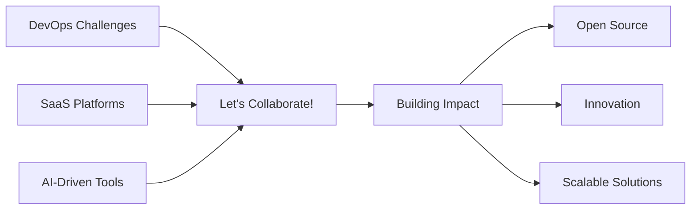

# <div align="center">👋 Hi, I'm Abhishek Singh</div>

<div align="center">
  
[](https://git.io/typing-svg)

</div>

<div align="center">
  
[](https://github.com/abhiya492)
[](https://github.com/abhiya492?tab=followers)
[](https://github.com/abhiya492?tab=repositories)

</div>

---

## 🎯 **Professional Objective**


```typescript
const abhishek = {
    role: "DevOps & SDE Engineer",
    education: "MNIT Jaipur",
    currentFocus: ["Cloud Architecture", "Automation", "Full Stack Development"],
    expertise: {
        devops: ["CI/CD", "Infrastructure as Code", "Container Orchestration"],
        cloud: ["AWS", "Azure", "Multi-Cloud Solutions"],
        development: ["MERN Stack", "Microservices", "API Design"]
    },
    mission: "Delivering innovative solutions through automation and scalable architecture",
    collaborationGoals: ["Open Source", "SaaS Platforms", "AI-Driven Tools"]
};
```

<br clear="right"/>

---

## 🌟 **About Me**

<table>
<tr>
<td width="50%">

🎓 **Education**: MNIT Jaipur  
🌱 **Currently Learning**: Advanced DevOps, Kubernetes, Microservices  
💡 **Passionate About**: Automation, Cloud Architecture, System Design  
🤝 **Open to Collaborate**: DevOps Tools, SaaS Apps, AI Projects  
🔍 **Interests**: Performance Optimization, Security, Scalability  
📫 **Reach Me**: [LinkedIn](https://linkedin.com/in/abhiya492) | [Email](mailto:abhiya492@example.com)

</td>
<td width="50%">

```yaml
daily_routine:
  morning:
    - ☕ Coffee
    - 📚 Tech Articles
    - 💻 Code Review
  afternoon:
    - 🔧 Building Projects
    - 🐛 Debugging
    - 🚀 Deploying Services
  evening:
    - 📖 Learning New Tech
    - 🤝 Community Engagement
    - 💡 Innovation Time
```

</td>
</tr>
</table>

---

## 🛠️ **Technology Arsenal**

<div align="center">

### 💼 **DevOps & Cloud**


### 💻 **Development Stack**


### 🗄️ **Databases & Tools**


### 📊 **Monitoring & Observability**


</div>

---

## 📊 **GitHub Analytics**

<div align="center">
  


</div>

<div align="center">

[](https://git.io/streak-stats)

</div>

<div align="center">

[](https://github.com/abhiya492)

</div>

---

## 🏆 **GitHub Trophies**

<div align="center">

[](https://github.com/abhiya492)

</div>

---

## 📈 **Contribution Graph**

<div align="center">


</div>

---

## 💼 **Featured Projects**

<div align="center">

<a href="https://github.com/abhiya492/project1">
  
</a>
<a href="https://github.com/abhiya492/project2">
  
</a>

</div>

---

## 🌟 **Daily Inspiration**

<div align="center">


</div>

---

## 📫 **Let's Connect**

<div align="center">

[](https://linkedin.com/in/abhiya492)
[](https://twitter.com/abhiya492)
[](mailto:abhiya492@gmail.com)
[](https://abhiya492.dev)
[](https://github.com/abhiya492)

</div>

---

## 🤝 **Open for Collaboration**

<div align="center">



</div>

<div align="center">

### 🚀 **"Code is poetry, DevOps is the rhythm that makes it flow"**

---


**⭐ From [abhiya492](https://github.com/abhiya492) | Made with ❤️ and ☕**

</div>
